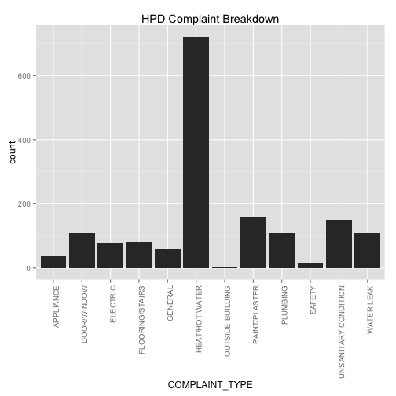

Project 2 required Jeffrey and I to import a large dataset into Oracle Server and call the data into RStudio for analysis. Below will describe the dataset and the following analysis. 

Dataset: Jcn565_311Calls

Oracle SQL Developer: C##CS329E_JCN565

Rows: 1804 observations

JCN565_311Calls is a collection of 311 Calls in New York City. 311 Call systems traditionally have been used to report incidents where the immediate presence of a police officer is not required, examples such as quality-of-life problems. The dataset will contain the dates, location, office of contact, complaint type, etc.of the 311 call.


__Figure 1. Table Variables__

Figure 1 displays the table variables used for this project.


__1. Loading of R packages: RCurl, ggplot2, dplyr, tidyr (R code not shown)__


__2. Call for JCN565_311Calls from the SQL Server using a data frame query__


```r
source("../01 Data/data_frame_orcl.R", echo = TRUE)
```

```
## 
## > df <- data.frame(eval(parse(text = substring(getURL(URLencode("http://129.152.144.84:5001/rest/native/?query=\"select * from JCN565_311Calls\""), 
## + .... [TRUNCATED]
```


__Figure 2. Sample of dataset JCN565_311Calls__

Figure 2 showcases a sample set of the dataset that we used for analysis. Please note the missing variables to the right of the figure. Below shows a simple breakdown of the complaint types grouped by the NYC Boroughs. This gives us a better idea of request/complaints by location.


```r
source('../02 Data Wrangling/DR5.R',echo = TRUE)
```

```
## 
## > df %>% group_by(BOROUGH, COMPLAINT_TYPE) %>% summarise(sum = sum(COMPLAINT_TYPE)) %>% 
## +     tbl_df
## Source: local data frame [106 x 3]
## 
##    BOROUGH     COMPLAINT_TYPE  sum
## 1    BRONX          APPLIANCE   32
## 2    BRONX   Blocked Driveway   28
## 3    BRONX        DOOR/WINDOW  266
## 4    BRONX           ELECTRIC  160
## 5    BRONX    FLOORING/STAIRS  288
## 6    BRONX            GENERAL  220
## 7    BRONX           Graffiti   36
## 8    BRONX     HEAT/HOT WATER 3198
## 9    BRONX    Illegal Parking   48
## 10   BRONX Noise - Commercial   18
## ..     ...                ...  ...
```

__3. Analysis of JCN565_311Calls__

```r
source ('../03 Visualization/plot NYC.R', echo = TRUE)
```

```
## 
## > ggplot(df, aes(x = LATITUDE, y = LONGITUDE, color = BOROUGH, 
## +     null.rm = TRUE)) + geom_point() + scale_y_discrete(labels = NULL) + 
## +     scale .... [TRUNCATED]
```

 

Coorindate points (Longitude and Longitude) from callers were documented and was used to help visualize the boroughs within New York City. The visual above was created for that purpose.


```r
source('../03 Visualization/plotagency.R', echo = TRUE)
```

```
## 
## > ggplot(data = df) + geom_histogram(aes(x = AGENCY)) + 
## +     ggtitle("311 Calls to Different Types of Agencies")
```

 

Graph above breaks down which agency receives the most 311 calls.


```r
source('../03 Visualization/complaint.R', echo = TRUE)
```

```
## 
## > complaint <- subset(df, AGENCY == "HPD", select = c(COMPLAINT_TYPE))
## 
## > ggplot(data = complaint, main = "HPD Complaint Breakdown") + 
## +     geom_histogram(aes(x = COMPLAINT_TYPE)) + theme(axis.text.x = element_text(angle .... [TRUNCATED]
```

 

You are able to see that Department of Housing Preservation and Development (HPD) receives the most complaints. From there, we analyzed to see what complaint types were most profound within HPD. We know overall HEAT/HOT WATER problem is most severe and would want to know in which borough is affected the most. Data frame #1 is imported, which is a dataset that contains information (zip code, borough, location, etc.) about the HEAT/HOT WATER problem. 

Overall HEAT/HOT WATER breakdown:
(data imported from data frame #1)

```r
source ('../01 Data/df1.R')
tbl_df(df1)
```

```
## Source: local data frame [722 x 3]
## 
##    COMPLAINT_TYPE          CITY INICIDENT_ZIP
## 1  HEAT/HOT WATER         BRONX         10451
## 2  HEAT/HOT WATER         BRONX         10472
## 3  HEAT/HOT WATER      NEW YORK         10040
## 4  HEAT/HOT WATER      NEW YORK         10010
## 5  HEAT/HOT WATER      NEW YORK         10024
## 6  HEAT/HOT WATER         BRONX         10466
## 7  HEAT/HOT WATER      NEW YORK         10040
## 8  HEAT/HOT WATER         BRONX         10463
## 9  HEAT/HOT WATER East Elmhurst         11369
## 10 HEAT/HOT WATER      BROOKLYN         11211
## ..            ...           ...           ...
```

```r
source('../02 Data Wrangling/DR1.R',echo = T)
```

```
## 
## > df1 %>% ggplot(aes(x = factor(CITY), fill = factor(INICIDENT_ZIP))) + 
## +     geom_bar(width = 1) + theme(axis.text.x = element_text(angle = 90, 
## +   .... [TRUNCATED]
```

 

Now we know BRONX, BROOKLYN, and NEW YORK has much more complaints than other boroughs. We will now focus on these three boroughs to see which specific area in each borough is most severe based on zipcode, it is better to represent each city through a histogram. 

For BRONX:
(data imported from data frame #2)

```r
source ('../01 Data/df2.R')
tbl_df(df2)
```

```
## Source: local data frame [246 x 2]
## 
##     CITY INICIDENT_ZIP
## 1  BRONX         10451
## 2  BRONX         10472
## 3  BRONX         10466
## 4  BRONX         10463
## 5  BRONX         10472
## 6  BRONX         10451
## 7  BRONX         10468
## 8  BRONX         10458
## 9  BRONX         10453
## 10 BRONX         10452
## ..   ...           ...
```

```r
View(df2) 
source('../02 Data Wrangling/DR2.R',echo = T)
```

```
## 
## > ggplot(df2) + geom_histogram(colour = "darkgreen", 
## +     aes(x = INICIDENT_ZIP)) + labs(title = "HEAT/HOT WATER Compliants Distribution by area in  ..." ... [TRUNCATED]
```

 

For BROOKLYN:
(data imported from data frame #3)

```r
source ('../01 Data/df3.R')
tbl_df(df3)
```

```
## Source: local data frame [209 x 2]
## 
##        CITY INICIDENT_ZIP
## 1  BROOKLYN         11211
## 2  BROOKLYN         11209
## 3  BROOKLYN         11213
## 4  BROOKLYN         11209
## 5  BROOKLYN         11214
## 6  BROOKLYN         11214
## 7  BROOKLYN         11221
## 8  BROOKLYN         11226
## 9  BROOKLYN         11218
## 10 BROOKLYN         11225
## ..      ...           ...
```

```r
source('../02 Data Wrangling/DR3.R',echo = T)
```

```
## 
## > ggplot(df3) + geom_histogram(colour = "darkgreen", 
## +     aes(x = INICIDENT_ZIP)) + labs(title = "HEAT/HOT WATER Compliants Distribution by areas in ..." ... [TRUNCATED]
```

 

For NEW YORK:
(data imported from data frame #4)

```r
source ('../01 Data/df4.R')
tbl_df(df4)
```

```
## Source: local data frame [165 x 2]
## 
##        CITY INICIDENT_ZIP
## 1  NEW YORK         10040
## 2  NEW YORK         10010
## 3  NEW YORK         10024
## 4  NEW YORK         10040
## 5  NEW YORK         10034
## 6  NEW YORK         10010
## 7  NEW YORK         10024
## 8  NEW YORK         10033
## 9  NEW YORK         10012
## 10 NEW YORK         10034
## ..      ...           ...
```

```r
source('../02 Data Wrangling/DR4.R',echo = T)
```

```
## 
## > ggplot(df4) + geom_histogram(colour = "darkgreen", 
## +     aes(x = INICIDENT_ZIP)) + labs(title = "HEAT/HOT WATER Compliants Distribution by areas in ..." ... [TRUNCATED]
```

 

By having this data, it can be used to help the city determine specific locations within NYC to be addressed first due to the amount of incoming 311 Calls. It can also be used to determine where to allocate city money in order to better the city and fully understand what issues occur in different boroughs.
